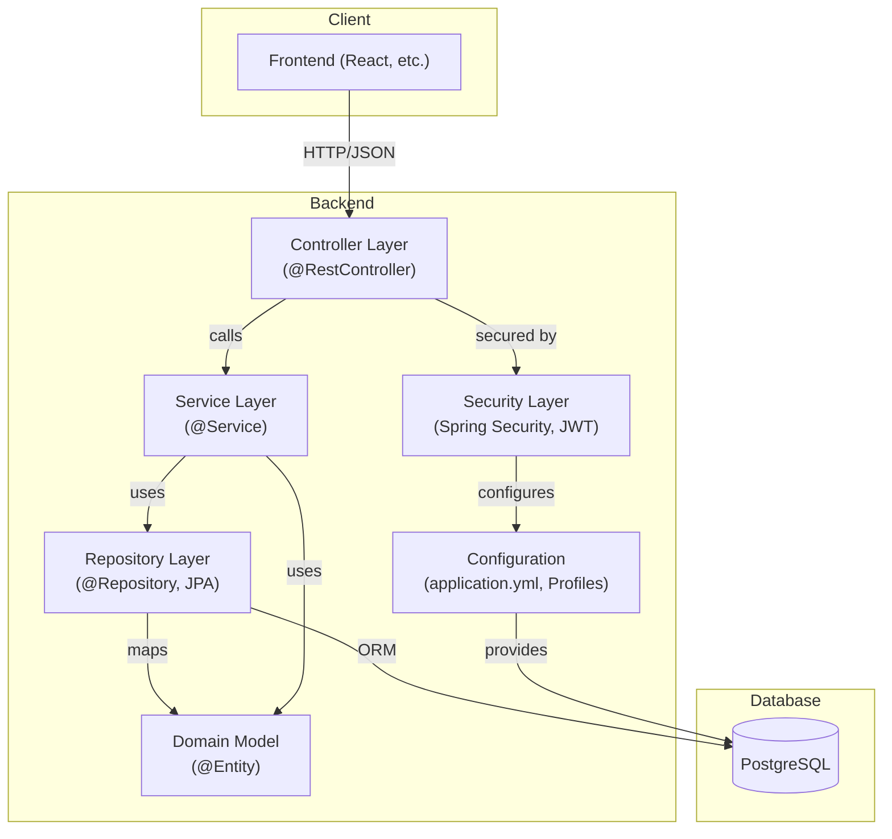

# Backend Technical Architecture

## Overview
This document describes the technical architecture for the backend system, which is based on Spring Boot, JWT authentication, and PostgreSQL. The architecture is designed for scalability, maintainability, and security, and is intended to support a modern web application with RESTful APIs.

## Technology Stack
- **Programming Language:** Java 17+
- **Framework:** Spring Boot 3.3.x+ LTS
- **ORM:** Spring Data JPA 3.x+ (Hibernate)
- **Database:** PostgreSQL
- **Authentication:** JWT (JSON Web Token)
- **Validation:** Bean Validation (JSR-380)
- **API Documentation:** Swagger/OpenAPI
- **Build Tool:** Gradle or Maven
- **Logging:** SLF4J & Logback
- **Unit Testing:** JUnit 5 + Mockito
- **Integration Testing:** SpringBootTest
- **Other:** Spring Security, Lombok, Testcontainers

## Layered Architecture

## Layer Responsibilities

- **Controller Layer:**
  - Exposes RESTful API endpoints
  - Handles HTTP requests and responses
  - Performs input validation and error handling
  - Delegates business logic to the Service layer

- **Service Layer:**
  - Implements business logic and application workflows
  - Manages transactions and orchestration
  - Interacts with the Repository layer for data access

- **Repository Layer:**
  - Provides CRUD operations for domain entities
  - Uses Spring Data JPA for ORM and query abstraction
  - Encapsulates all database access logic

- **Domain Model:**
  - Represents core business entities (annotated with @Entity)
  - Encapsulates business rules and relationships

- **Security Layer:**
  - Manages authentication and authorization (Spring Security)
  - Issues and validates JWT tokens
  - Secures API endpoints based on roles/permissions

- **Configuration:**
  - Manages environment-specific settings (application.yml, profiles)
  - Configures database, security, and other infrastructure

## Key Architectural Features
- Stateless JWT authentication for REST APIs
- Separation of concerns via layered architecture
- Environment-based configuration for dev/prod/test
- API documentation and validation for robust client integration
- Designed for extensibility (e.g., adding new domains, security policies)

---

**This document is intended for use by developers and AI agents as a reference for backend system design and integration.** 