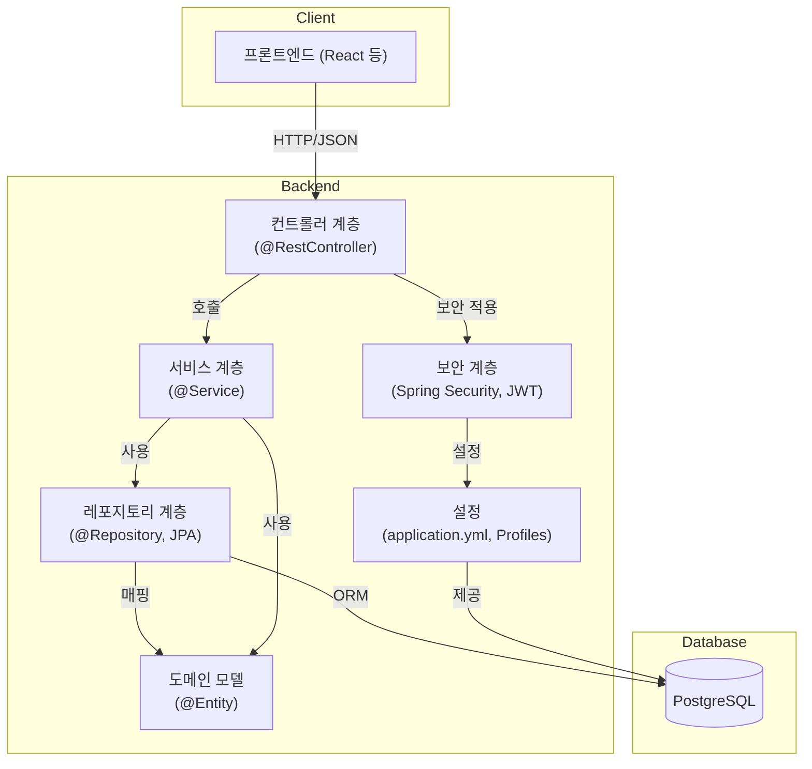

# 백엔드 기술 아키텍처

## 개요
이 문서는 Spring Boot, JWT 인증, PostgreSQL을 기반으로 하는 백엔드 시스템의 기술 아키텍처를 설명합니다. 이 아키텍처는 확장성, 유지보수성, 보안을 위해 설계되었으며, RESTful API를 통한 현대적인 웹 애플리케이션을 지원하기 위한 것입니다.

## 기술 스택
- **프로그래밍 언어:** Java 17+
- **프레임워크:** Spring Boot 3.3.x+ LTS
- **ORM:** Spring Data JPA 3.x+ (Hibernate)
- **데이터베이스:** PostgreSQL
- **인증:** JWT (JSON Web Token)
- **유효성 검사:** Bean Validation (JSR-380)
- **API 문서화:** Swagger/OpenAPI
- **빌드 도구:** Gradle 또는 Maven
- **로깅:** SLF4J & Logback
- **단위 테스트:** JUnit 5 + Mockito
- **통합 테스트:** SpringBootTest
- **기타:** Spring Security, Lombok, Testcontainers

## 계층형 아키텍처

## 계층별 책임

- **컨트롤러 계층:**
  - RESTful API 엔드포인트 노출
  - HTTP 요청 및 응답 처리
  - 입력 유효성 검사 및 오류 처리
  - 비즈니스 로직을 서비스 계층으로 위임

- **서비스 계층:**
  - 비즈니스 로직 및 애플리케이션 워크플로 구현
  - 트랜잭션 관리 및 오케스트레이션
  - 데이터 액세스를 위한 레포지토리 계층과 상호작용

- **레포지토리 계층:**
  - 도메인 엔티티에 대한 CRUD 작업 제공
  - ORM 및 쿼리 추상화를 위한 Spring Data JPA 사용
  - 모든 데이터베이스 액세스 로직 캡슐화

- **도메인 모델:**
  - 핵심 비즈니스 엔티티 표현 (@Entity로 어노테이션)
  - 비즈니스 규칙 및 관계 캡슐화

- **보안 계층:**
  - 인증 및 권한 부여 관리 (Spring Security)
  - JWT 토큰 발급 및 검증
  - 역할/권한 기반 API 엔드포인트 보안

- **설정:**
  - 환경별 설정 관리 (application.yml, profiles)
  - 데이터베이스, 보안 및 기타 인프라 구성

## 주요 아키텍처 특징
- REST API를 위한 상태 비저장 JWT 인증
- 계층형 아키텍처를 통한 관심사 분리
- 개발/운영/테스트 환경별 설정
- 견고한 클라이언트 통합을 위한 API 문서화 및 유효성 검사
- 확장성을 위한 설계 (예: 새로운 도메인, 보안 정책 추가)

---

**이 문서는 개발자와 AI 에이전트가 백엔드 시스템 설계 및 통합을 위한 참고 자료로 사용하기 위한 것입니다.** 