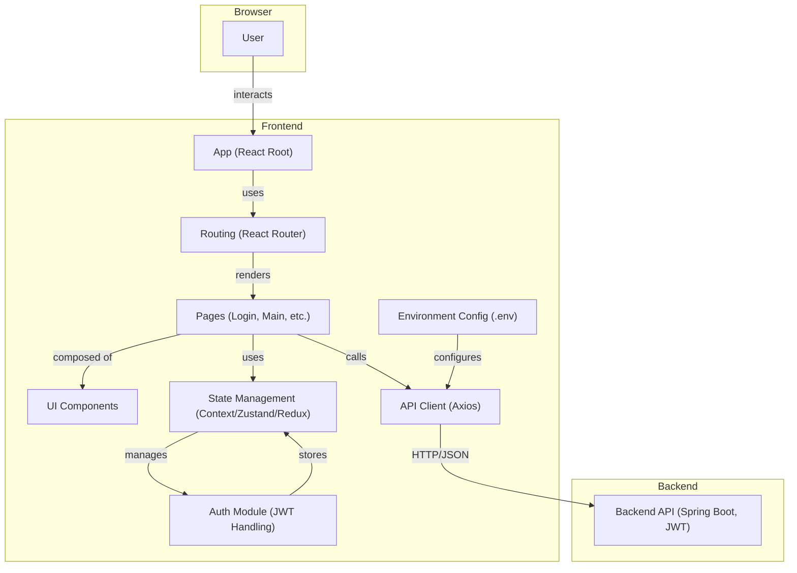

# Frontend Technical Architecture

## Overview
This document describes the technical architecture for the frontend system, which is based on React and communicates with a RESTful backend using JWT authentication. The architecture is designed for modularity, maintainability, and scalability, and is intended to support a modern single-page application (SPA).

## Technology Stack
- **Framework:** React.js
- **Language:** TypeScript
- **Build Tool:** Vite
- **Styling:** Tailwind CSS
- **UI Components:** shadcn/ui
- **State Management:** Zustand
- **Routing:** React Router
- **HTTP Client:** Axios or Fetch API
- **Form Handling:** React Hook Form
- **Schema Validation:** Zod
- **Server State Management:** TanStack Query (for caching, synchronization, and automatic updates)
- **Unit Testing:** Vitest (with mocking, snapshots, and code coverage)
- **E2E Testing:** Playwright
- **Code Quality:** ESLint, Prettier
- **Environment Variables:** .env files

## Application Architecture

## Layer Responsibilities

- **App (Root):**
  - Initializes the application and global providers (Zustand stores, TanStack Query client)

- **Routing:**
  - Manages navigation and protected routes using React Router
  - Handles route-based code splitting

- **Pages:**
  - Represents major screens (e.g., Login, Main)
  - Orchestrates shadcn/ui components and business logic for each screen
  - Uses TanStack Query for server state management

- **UI Components:**
  - Built with shadcn/ui component library on top of Tailwind CSS
  - Reusable presentational and container components
  - Encapsulate UI logic and styling with TypeScript interfaces

- **State Management:**
  - **Client State:** Managed with Zustand stores (user, auth, UI state)
  - **Server State:** Managed with TanStack Query (API data, caching, synchronization)
  - Provides strongly-typed state with TypeScript

- **API Client:**
  - Handles HTTP requests to the backend
  - Integrates with TanStack Query for data fetching and caching
  - Manages JWT token in headers and error handling

- **Auth Module:**
  - Manages login/logout, token storage (localStorage/sessionStorage)
  - Handles authentication state with Zustand
  - Provides TypeScript interfaces for auth-related types

- **Forms & Validation:**
  - **Form Handling:** React Hook Form for performant forms
  - **Schema Validation:** Zod for runtime type checking and validation
  - **Type Safety:** Full TypeScript integration between forms and API

- **Environment Config:**
  - Stores environment-specific variables (API base URL, etc.)
  - Configured through Vite's environment system

## Key Architectural Features
- **Type Safety:** Full TypeScript coverage for enhanced developer experience and runtime safety
- **Modern Build System:** Vite for fast development and optimized production builds
- **Design System:** shadcn/ui components with Tailwind CSS for consistent, beautiful UI
- **Smart State Management:** 
  - Zustand for lightweight client state
  - TanStack Query for intelligent server state with caching and synchronization
- **Robust Form Handling:** React Hook Form + Zod for performant, type-safe forms
- **Comprehensive Testing:**
  - Vitest for fast unit and integration testing
  - Playwright for reliable E2E testing
- **JWT-based authentication and protected routes**
- **Modular, component-driven design for scalability**
- **Environment-based configuration for dev/prod**
- **Clear separation of concerns between UI, state, and API logic**

---

**This document is intended for use by developers and AI agents as a reference for frontend system design and integration.** 