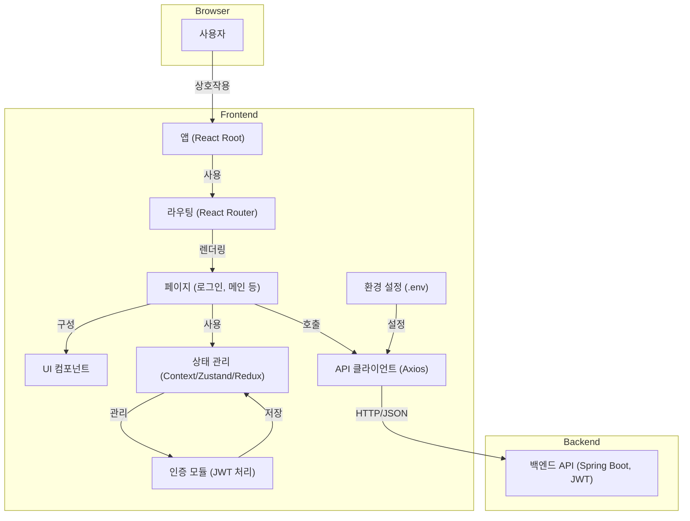

# 프론트엔드 기술 아키텍처

## 개요
이 문서는 React를 기반으로 하고 JWT 인증을 사용하여 RESTful 백엔드와 통신하는 프론트엔드 시스템의 기술 아키텍처를 설명합니다. 이 아키텍처는 모듈성, 유지보수성, 확장성을 위해 설계되었으며, 현대적인 단일 페이지 애플리케이션(SPA)을 지원하기 위한 것입니다.

## 기술 스택
- **프레임워크:** React.js
- **언어:** TypeScript
- **빌드 도구:** Vite
- **스타일링:** Tailwind CSS
- **UI 컴포넌트:** shadcn/ui
- **상태 관리:** Zustand
- **라우팅:** React Router
- **HTTP 클라이언트:** Axios 또는 Fetch API
- **폼 처리:** React Hook Form
- **스키마 검증:** Zod
- **토스트 알림:** Sonner (애니메이션과 제스처를 지원하는 현대적인 토스트)
- **서버 상태 관리:** TanStack Query (캐싱, 동기화, 자동 업데이트용)
- **단위 테스트:** Vitest (모킹, 스냅샷, 코드 커버리지 포함)
- **E2E 테스트:** Playwright
- **코드 품질:** ESLint, Prettier
- **환경 변수:** .env 파일

## 애플리케이션 아키텍처

## 계층별 책임

- **앱 (Root):**
  - 애플리케이션 초기화 및 글로벌 프로바이더 (Zustand 스토어, TanStack Query 클라이언트)

- **라우팅:**
  - React Router를 사용한 네비게이션 및 보호된 라우트 관리
  - 라우트 기반 코드 스플리팅 처리

- **페이지:**
  - 주요 화면 표현 (예: 로그인, 메인)
  - 각 화면의 shadcn/ui 컴포넌트 및 비즈니스 로직 오케스트레이션
  - 서버 상태 관리를 위한 TanStack Query 사용

- **UI 컴포넌트:**
  - Tailwind CSS 기반의 shadcn/ui 컴포넌트 라이브러리로 구축
  - 재사용 가능한 프레젠테이션 및 컨테이너 컴포넌트
  - TypeScript 인터페이스를 통한 UI 로직 및 스타일링 캡슐화

- **상태 관리:**
  - **클라이언트 상태:** Zustand 스토어로 관리 (사용자, 인증, UI 상태)
  - **서버 상태:** TanStack Query로 관리 (API 데이터, 캐싱, 동기화)
  - TypeScript를 통한 강타입 상태 제공

- **API 클라이언트:**
  - 백엔드로의 HTTP 요청 처리
  - 데이터 가져오기 및 캐싱을 위한 TanStack Query 통합
  - 헤더의 JWT 토큰 관리 및 오류 처리
  - 사용자 친화적인 에러 알림을 위한 Sonner 활용

- **인증 모듈:**
  - 로그인/로그아웃, 토큰 저장 관리 (localStorage/sessionStorage)
  - Zustand를 통한 인증 상태 처리
  - 인증 관련 타입을 위한 TypeScript 인터페이스 제공

- **폼 및 검증:**
  - **폼 처리:** 성능 최적화된 폼을 위한 React Hook Form
  - **스키마 검증:** 런타임 타입 검사 및 검증을 위한 Zod
  - **타입 안전성:** 폼과 API 간의 완전한 TypeScript 통합

- **환경 설정:**
  - 환경별 변수 저장 (API 베이스 URL 등)
  - Vite의 환경 시스템을 통한 설정

## 주요 아키텍처 특징
- **타입 안전성:** 향상된 개발자 경험과 런타임 안전성을 위한 완전한 TypeScript 커버리지
- **현대적인 빌드 시스템:** 빠른 개발과 최적화된 프로덕션 빌드를 위한 Vite
- **디자인 시스템:** 일관되고 아름다운 UI를 위한 Tailwind CSS와 shadcn/ui 컴포넌트
- **현대적인 사용자 경험:** 부드러운 애니메이션과 제스처 지원을 제공하는 Sonner 토스트 알림
- **스마트 상태 관리:** 
  - 경량 클라이언트 상태를 위한 Zustand
  - 캐싱 및 동기화를 통한 지능적인 서버 상태를 위한 TanStack Query
- **견고한 폼 처리:** 성능 최적화되고 타입 안전한 폼을 위한 React Hook Form + Zod
- **포괄적인 테스팅:**
  - 빠른 단위 및 통합 테스트를 위한 Vitest
  - 신뢰할 수 있는 E2E 테스트를 위한 Playwright
- **JWT 기반 인증 및 보호된 라우트**
- **확장성을 위한 모듈형, 컴포넌트 중심 설계**
- **개발/운영 환경별 설정**
- **UI, 상태, API 로직 간의 명확한 관심사 분리**

---

**이 문서는 개발자와 AI 에이전트가 프론트엔드 시스템 설계 및 통합을 위한 참고 자료로 사용하기 위한 것입니다.** 