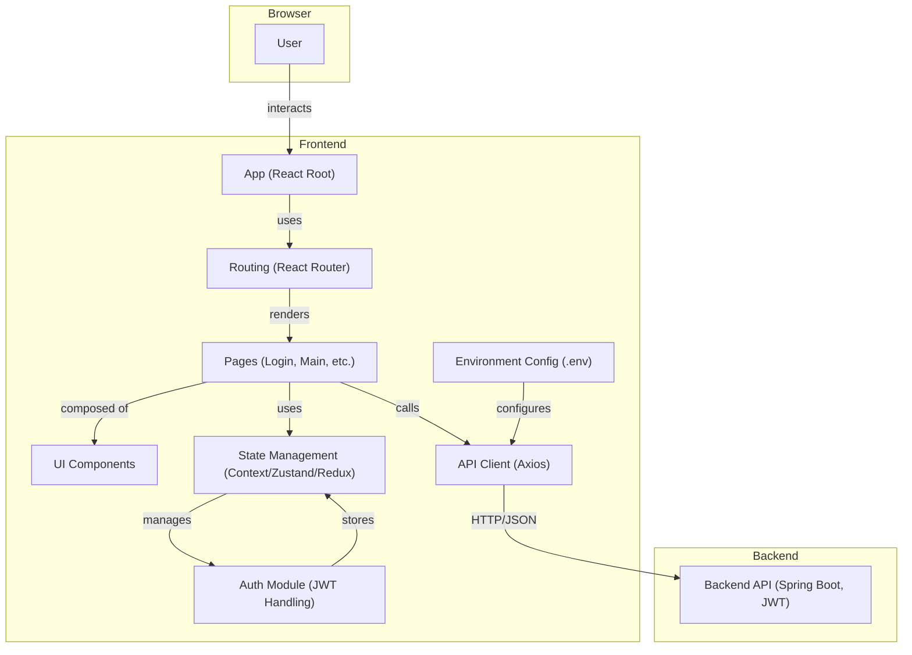

# Frontend Technical Architecture

## Overview
This document describes the technical architecture for the frontend system, which is based on React and communicates with a RESTful backend using JWT authentication. The architecture is designed for modularity, maintainability, and scalability, and is intended to support a modern single-page application (SPA).

## Technology Stack
- **Framework:** React (with Vite or CRA)
- **Language:** JavaScript (ES6+) or TypeScript
- **State Management:** React Context, Zustand, or Redux (as needed)
- **Routing:** React Router
- **HTTP Client:** Axios or Fetch API
- **Form Handling:** React Hook Form or Formik
- **Validation:** Yup or custom validation
- **Styling:** CSS Modules, Styled Components, or Tailwind CSS
- **Testing:** Jest, React Testing Library
- **Build Tool:** Vite or Create React App
- **Other:** ESLint, Prettier, .env for environment variables

## Application Architecture

## Layer Responsibilities

- **App (Root):**
  - Initializes the application and global providers

- **Routing:**
  - Manages navigation and protected routes
  - Handles route-based code splitting

- **Pages:**
  - Represents major screens (e.g., Login, Main)
  - Orchestrates UI components and business logic for each screen

- **UI Components:**
  - Reusable presentational and container components
  - Encapsulate UI logic and styling

- **State Management:**
  - Manages global and local state (e.g., user, auth, UI state)
  - Provides context to components

- **API Client:**
  - Handles HTTP requests to the backend
  - Manages JWT token in headers and error handling

- **Auth Module:**
  - Manages login/logout, token storage (localStorage/sessionStorage)
  - Handles authentication state and guards

- **Environment Config:**
  - Stores environment-specific variables (API base URL, etc.)

## Key Architectural Features
- JWT-based authentication and protected routes
- Modular, component-driven design for scalability
- Environment-based configuration for dev/prod
- Clear separation of concerns between UI, state, and API logic
- Designed for easy integration with backend and future extensibility

---

**This document is intended for use by developers and AI agents as a reference for frontend system design and integration.** 