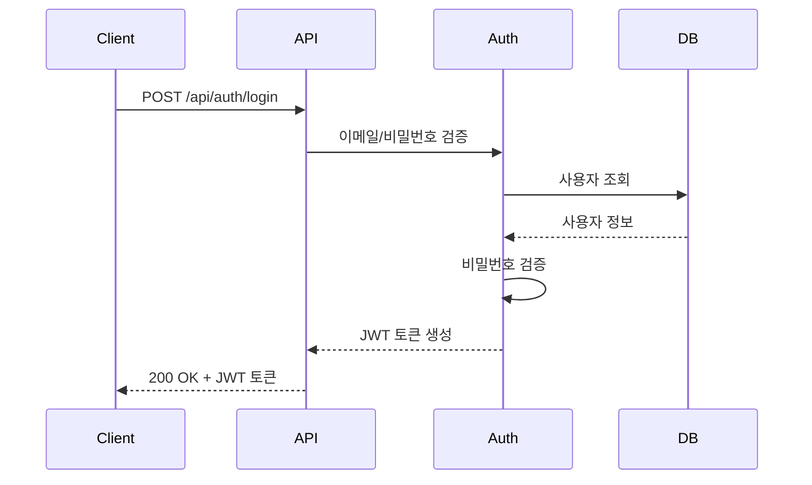
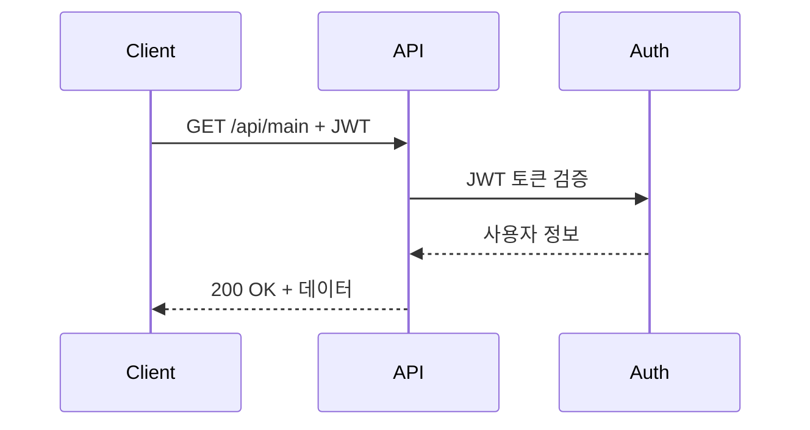

# API Endpoints Specification

## 개요
이 문서는 PMO 애플리케이션의 모든 API 엔드포인트를 데이터 아키텍처 관점에서 정의합니다.

## API 버전 관리
- **Base URL**: `/api`
- **API Version**: v1 (현재 URL에 버전 명시하지 않음, 향후 `/api/v1/` 형태로 확장 가능)
- **Content-Type**: `application/json`
- **Character Encoding**: UTF-8

---

## 인증 관련 API

### 1. 사용자 로그인
```http
POST /api/auth/login
```

#### Request
| Field | Type | Required | Description | Validation |
|-------|------|----------|-------------|------------|
| email | string | Yes | 사용자 이메일 | @Email, @NotBlank |
| password | string | Yes | 사용자 비밀번호 | @NotBlank, 최소 8자 |

```json
{
  "email": "test@test.com",
  "password": "password123"
}
```

#### Response - Success (200 OK)
| Field | Type | Description |
|-------|------|-------------|
| accessToken | string | JWT 액세스 토큰 |
| tokenType | string | 토큰 타입 (Bearer) |
| expiresIn | number | 토큰 만료 시간 (초) |

```json
{
  "accessToken": "eyJhbGciOiJIUzI1NiIsInR5cCI6IkpXVCJ9...",
  "tokenType": "Bearer",
  "expiresIn": 3600
}
```

#### Response - Error (401 Unauthorized)
```json
{
  "message": "이메일 또는 비밀번호가 일치하지 않습니다.",
  "timestamp": "2024-01-15T10:30:00Z"
}
```

---

## 메인 서비스 API

### 2. 메인 페이지 데이터 조회
```http
GET /api/main
Authorization: Bearer {accessToken}
```

#### Request
- **Headers**: `Authorization: Bearer {accessToken}`
- **Body**: 없음

#### Response - Success (200 OK)
| Field | Type | Description |
|-------|------|-------------|
| message | string | 환영 메시지 |
| user | object | 사용자 정보 |
| user.email | string | 사용자 이메일 |
| user.name | string | 사용자 이름 |

```json
{
  "message": "안녕하세요, test@test.com 님!",
  "user": {
    "email": "test@test.com",
    "name": "테스트 사용자"
  }
}
```

#### Response - Error (401 Unauthorized)
```json
{
  "message": "인증이 필요합니다.",
  "timestamp": "2024-01-15T10:30:00Z"
}
```

---

## 공통 응답 구조

### 성공 응답
- **상태 코드**: 200 OK
- **Content-Type**: application/json
- **구조**: API별 특정 데이터 구조

### 에러 응답 표준화
모든 에러 응답은 다음 구조를 따릅니다:

```json
{
  "message": "에러 메시지",
  "timestamp": "ISO 8601 형식 타임스탬프"
}
```

#### HTTP 상태 코드
| Status Code | Description | Usage |
|-------------|-------------|-------|
| 200 | OK | 성공 응답 |
| 400 | Bad Request | 요청 데이터 검증 실패 |
| 401 | Unauthorized | 인증 실패 또는 토큰 없음 |
| 403 | Forbidden | 권한 없음 |
| 404 | Not Found | 리소스 없음 |
| 500 | Internal Server Error | 서버 내부 오류 |

---

## JWT 토큰 구조

### JWT Header
```json
{
  "alg": "HS256",
  "typ": "JWT"
}
```

### JWT Payload
```json
{
  "sub": "user_email@test.com",
  "iat": 1642248000,
  "exp": 1642251600,
  "email": "user_email@test.com"
}
```

### 토큰 정책
- **알고리즘**: HS256
- **만료시간**: 3600초 (1시간)
- **Secret Key**: 환경변수로 관리
- **토큰 타입**: Bearer

---

## 데이터 검증 규칙

### 이메일 검증
- **Format**: RFC 5322 표준
- **Annotation**: `@Email`, `@NotBlank`
- **Example**: `user@domain.com`

### 비밀번호 정책
- **최소 길이**: 8자
- **Annotation**: `@NotBlank`, `@Size(min=8)`
- **보안**: 평문 저장 금지, BCrypt 해싱

### 날짜/시간 형식
- **Format**: ISO 8601 (yyyy-MM-dd'T'HH:mm:ss'Z')
- **Timezone**: UTC
- **Example**: `2024-01-15T10:30:00Z`

---

## API 호출 흐름

### 1. 로그인 플로우


### 2. 인증된 API 호출 플로우


---

## 향후 확장 계획

### Phase 2 추가 예정 API
- `POST /api/auth/refresh` - 토큰 갱신
- `POST /api/auth/logout` - 로그아웃
- `PUT /api/user/password` - 비밀번호 변경
- `GET /api/user/profile` - 사용자 프로필 조회

### API 버전 관리 계획
- 현재: `/api/endpoint`
- 향후: `/api/v1/endpoint`, `/api/v2/endpoint`
- 하위 호환성 유지 정책

---

**이 문서는 개발자와 프론트엔드 팀이 API 연동 시 참고하는 데이터 계약서입니다.**
