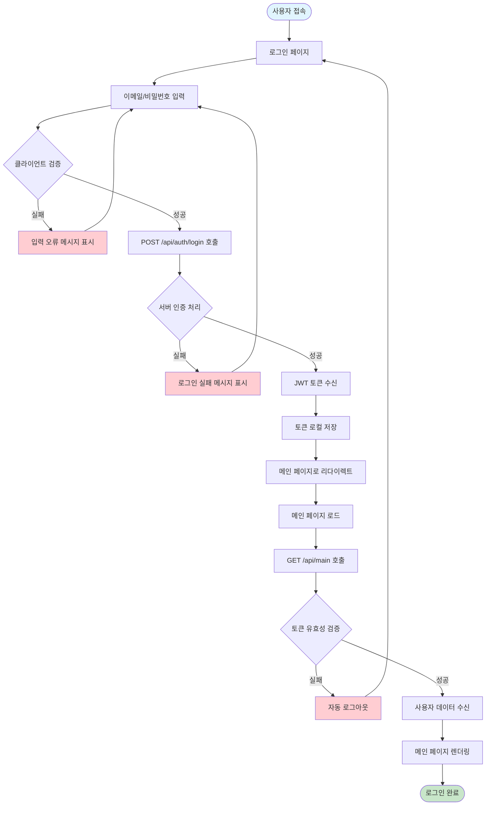
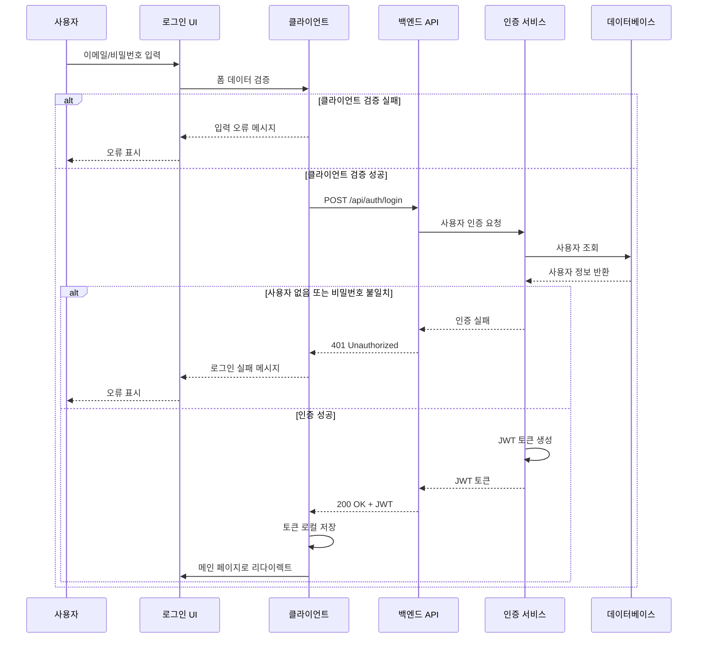
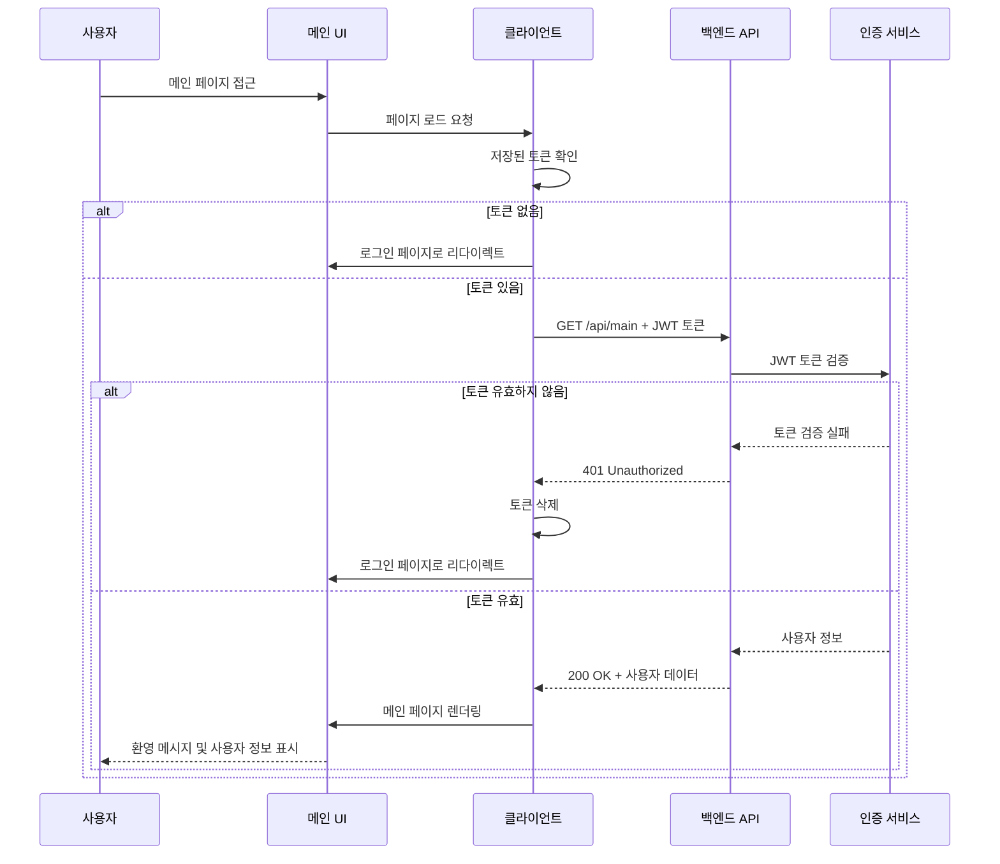
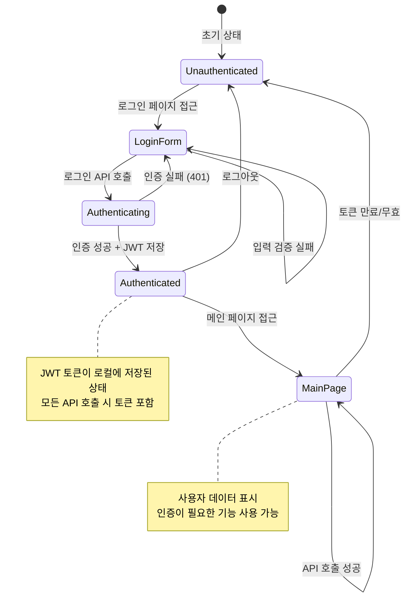
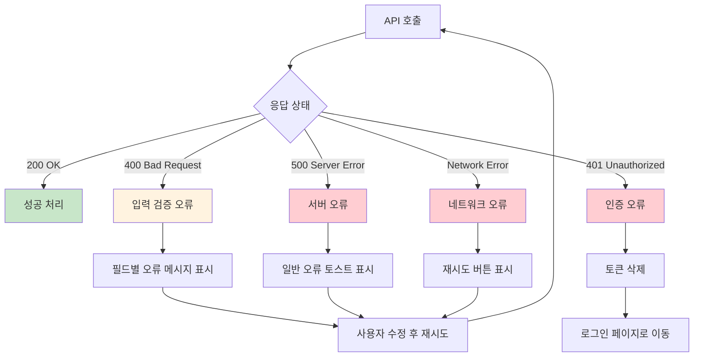

# Flow 001: 사용자 로그인 플로우

## 개요
사용자가 로그인 페이지에서 인증을 거쳐 메인 페이지에 진입하는 전체 플로우를 정의합니다.

---

## 전체 사용자 플로우

---

## 세부 시퀀스 다이어그램

### 1. 로그인 인증 시퀀스

### 2. 메인 페이지 접근 시퀀스

---

## 상태 다이어그램

---

## 에러 처리 플로우

---

## 플로우 체크포인트

### 성공 시나리오
1. ✅ 사용자가 올바른 이메일/비밀번호 입력
2. ✅ 클라이언트 측 검증 통과
3. ✅ 서버 인증 성공
4. ✅ JWT 토큰 발급 및 저장
5. ✅ 메인 페이지 리다이렉트
6. ✅ 토큰을 사용한 API 호출 성공
7. ✅ 사용자 데이터 표시

### 실패 시나리오
1. ❌ 잘못된 이메일 형식 → 클라이언트 검증 실패
2. ❌ 존재하지 않는 사용자 → 401 Unauthorized
3. ❌ 잘못된 비밀번호 → 401 Unauthorized  
4. ❌ 만료된 토큰 → 자동 로그아웃
5. ❌ 네트워크 오류 → 재시도 옵션 제공

---

## 관련 문서
- [API 엔드포인트 명세](../../01_architecture/02_da/api_endpoints.md)
- [백엔드 기술 아키텍처](../../01_architecture/01_ta/backend-architecture-kor.md)
- [Topic01 API 설계](../../00_roadmap/topic01_jwt-authentication/topic01-phase01-task01-api-design.md)
